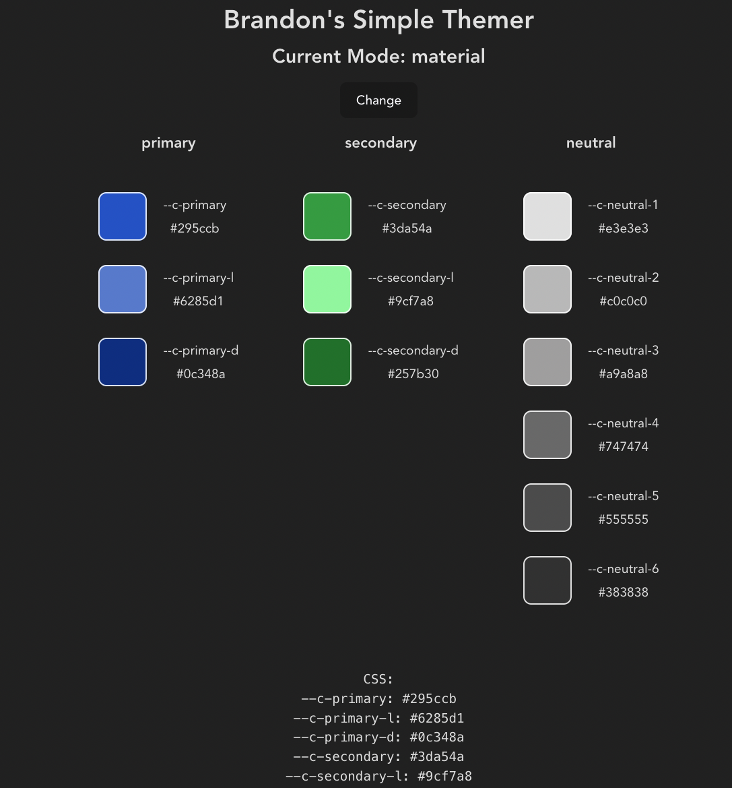

# Brandon's Simple Themer

A very simple site for picking color palettes that gets translated to CSS variables.

  

## Features
- Hex color picker with opacity.
- Outputs CSS variables.
- Use in tailwind (more granular colors) or material (a few variants) mode.

## Uses
- Preact
- react-colorful
- Vite
- Typescript